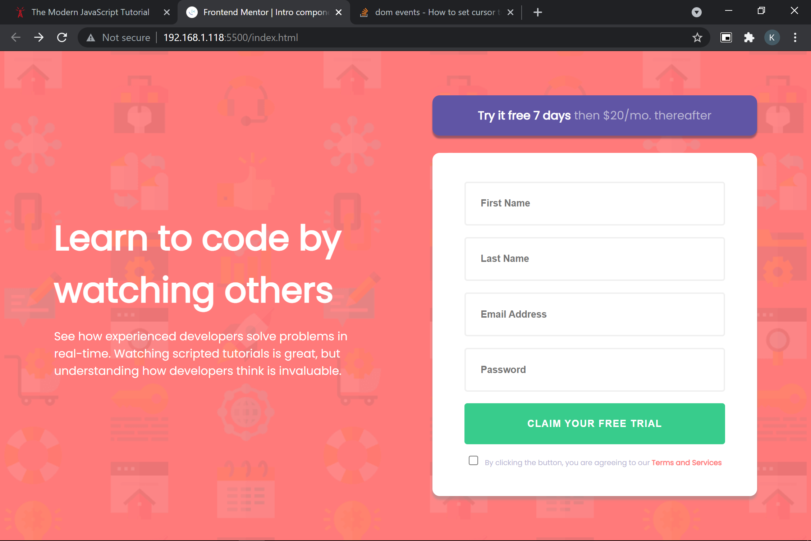

# Frontend Mentor - Intro component with sign up form solution

For live preview [click here](https://kar-cee.github.io/intro-component-with-signup-form-master/)

### Screenshot

## Desktop

## Mobile

### Built with

- Semantic HTML5 markup
- CSS custom properties
- Flexbox
- Desktop-first workflow

### What I learned
I have learned to connect the dot by looking backward not forward.
Here, I was able to combine all peices behind the form in one go  with this project.
I strumble in by beleiving in me and today it paid the prize.

## Future (letter to 2022 self)
Looking forward to building more interesting stuffs and upgrade my computer skill. You have came this far and its all because of you hardwork and consistancy. you can do a lot better; be in the discipline

## Author
Karma Tsering
